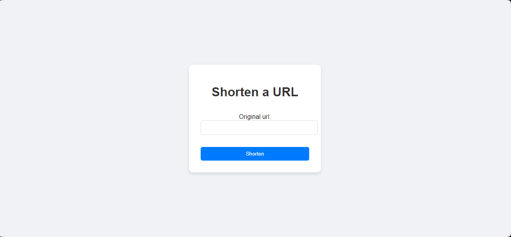
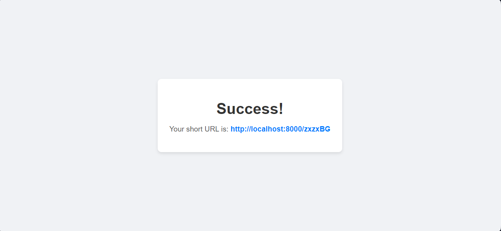

# URL-Shortner-app--Django

A simple URL shortener application built with Django. This application allows users to shorten long URLs and redirect them to the original URLs using the shortened links.

### Screenshots





## Features

- Shorten long URLs
- Redirect to original URLs using short URLs
- Simple and user-friendly interface

## Getting Started

Follow these instructions to get a copy of the project up and running on your local machine for development and testing purposes.

### Prerequisites

- Python 3.6+
- Django 3.0+

### Installation

1. **Clone the repository:**

    ```bash
    git clone https://github.com/kavindu-vk/URL-Shortner-app--Django.git
    cd URL-Shortner-app--Django
    ```

2. **Create and activate a virtual environment:**

    ```bash
    python -m venv env
    source env/bin/activate  # On Windows use `env\Scripts\activate`
    ```

3. **Install the required packages:**

    ```bash
    pip install -r requirements.txt
    ```

4. **Run database migrations:**

    ```bash
    python manage.py makemigrations
    python manage.py migrate
    ```

5. **Run the development server:**

    ```bash
    python manage.py runserver
    ```

6. **Open your browser and navigate to:**

    ```
    http://localhost:8000/
    ```

## Usage

### Home Page

The home page allows you to enter a URL that you want to shorten.

- **Enter URL**: Input the long URL you want to shorten.
- **Shorten Button**: Click the "Shorten" button to generate a short URL.

### Success Page

After submitting a URL, you will be redirected to a success page displaying the shortened URL.

- **Short URL**: A link to the shortened URL is provided. Clicking this link will redirect you to the original URL.

### Redirecting

Access the short URL in your browser to be redirected to the original URL.
